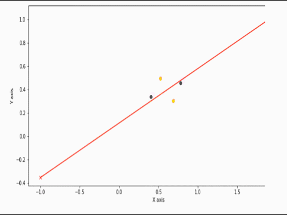

# ABOUT

In this Mini Project, we make a basic feed forward Neural Network using numpy which learns the XOR function.
The motive is to understand what the hidden layer is doing and how the neural network transforms the data non-linearly.

# REFERENCES

www.deeplearningbook.org | Chapter 6 | Page 167 (Learning XOR)

